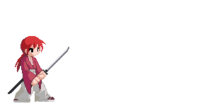

<h1 align="center"> Hello there! Welcome to my GitHub profile! 👋</h1>

    

---

### 🌟 About Me:
- 👨‍💻 I’m a passionate software developer and tech enthusiast.
- 🌱 Currently learning: **C#**
- 📫 How to reach me: [Telegram Pv](https://t.me/The_azizi)

---

### 🛠️ My Skills & Tech Stack:

         

---

### 🎵 Spotify Recently Played:

---

## 🛸 GitHub Stats:

  
  

---

### 📢 Connect with Me:

    

---

  <h4>✨ Keep coding, keep growing!✨</h4>

